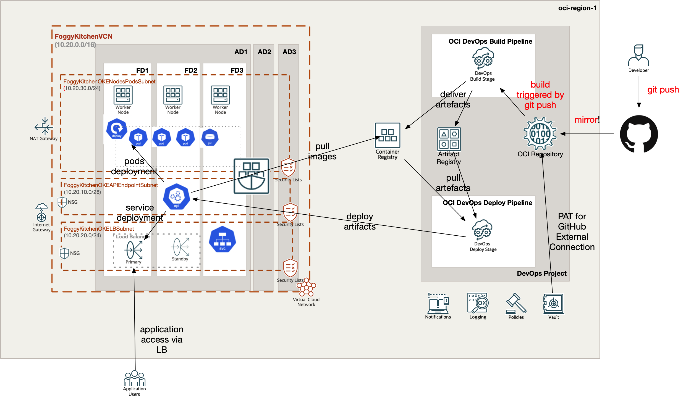

# FoggyKitchen OCI DevOps Service with Terraform

## Course description

The OCI DevOps Service with Terraform course provides a comprehensive guide to implementing a robust DevOps workflow using Oracle Cloud Infrastructure (OCI) and Terraform. Through a series of six lessons, you will learn how to leverage OCI DevOps Service and Terraform to automate the build, delivery, and deployment of your applications.

[Lesson 1: Creating an Empty DevOps Project with Logging and Notification Services](lesson1_empty_devops_project)

In this lesson, you will learn to use Terraform to set up an empty DevOps project and integrate essential services like Logging and Notification. This lesson establishes the groundwork for subsequent lessons and ensures a collaborative and monitored environment for your development team.

[Lesson 2: Mirroring GitHub Repository into DevOps Project](lesson2_mirrored_github_repo_into_devops_project)

In the second lesson, you will discover how to mirror a GitHub repository into your DevOps project. By establishing an external connection and periodically synchronizing changes, you can seamlessly integrate your GitHub repository with the DevOps project.

[Lesson 3: Adding OCI DevOps Build Pipeline - Build Stage](lesson3_devops_build_pipeline_with_build_stage)

This lesson focuses on implementing the Build Stage of the OCI DevOps Build Pipeline. By defining the compute power details, you will be able to execute the build process based on the build_spec.yaml file and generate a Docker image for your application.

[Lesson 4: Adding OCI DevOps Build Pipeline - Deliver Artifact Stage](lesson4_devops_build_pipeline_with_deliver_artifact_stage)

In the fourth lesson, you will enhance your DevOps project by adding the Deliver Artifact Stage to the Build Pipeline. This stage produces a Docker image stored in the OCI Registry and constructs a Helm Artifact, including a Helm chart for the deployment.

[Lesson 5: Adding OCI DevOps Deploy Pipeline - Trigger and Helm Deployment](lesson5_devops_deploy_pipeline)

The fifth lesson covers the creation of the OCI DevOps Deploy Pipeline. By configuring the Trigger and Helm Deployment Stage, you will automate the deployment of your Dockerized application to an OCI Container Engine for Kubernetes (OKE) cluster. This lesson includes the provisioning of the necessary infrastructure and exposes the application through a public Load Balancer.

[Lesson 6: Adding OCI DevOps Trigger - Automating Build and Deploy Pipelines](lesson6_deveops_trigger_pipelines)

In the sixth lesson, you will automate the triggering of the Build and Deploy Pipelines by adding the OCI DevOps Trigger. Based on push operations to the OCI DevOps Repository's main branch, the pipelines will automatically initiate, eliminating the need for manual intervention.

[Lesson 7: OCI DevOps Canary Deployment](lesson7_devops_canary_deployment)

In our seventh lesson, we will dive into advanced deployment strategies by configuring a Canary Deployment pipeline in OCI DevOps Service. Canary Deployment gradually introduces a new version alongside the existing production version, routing a small portion of the traffic to evaluate its performance and stability before wider adoption.

[Lesson 8: OCI DevOps Blue-Green Deployment](lesson8_devops_bluegreen_deployment)

In our eighth lesson, we will explore advanced deployment strategies by configuring a Blue-Green Deployment pipeline in OCI DevOps Service. Blue-Green Deployment involves creating two independent environments: the existing production environment (blue) and the new version environment (green), with an instant switch of traffic between the two for seamless deployment without downtime.

By completing this course, you will have gained the knowledge and skills to establish a robust DevOps workflow using OCI DevOps Service and Terraform. You will be able to efficiently build, deliver, and deploy your applications, ensuring a seamless integration between development and operations within the Oracle Cloud Infrastructure environment.

