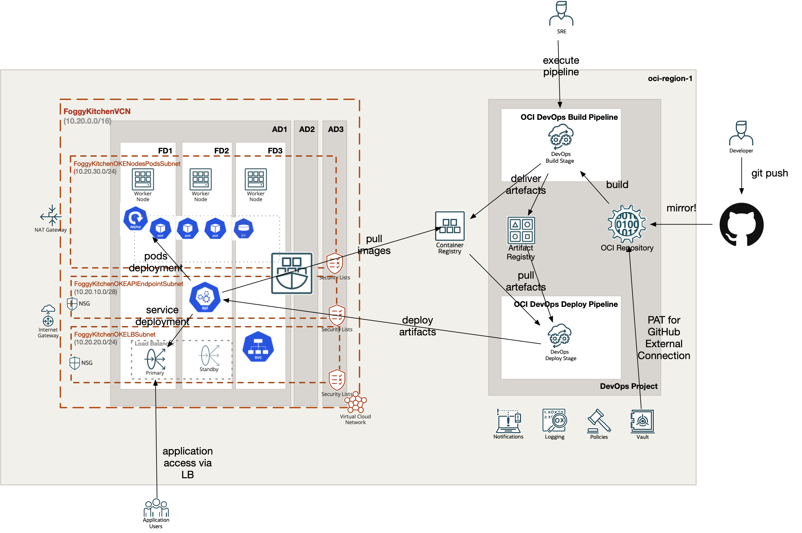

# FoggyKitchen OCI DevOps Service with Terraform 

## LESSON 5 - Deploy Pipeline added in DevOps Project

In the fifth lesson of the OCI DevOps Service course deployed with Terraform, you will complete the implementation of your DevOps project by adding the OCI DevOps Deploy Pipeline. This lesson focuses on creating the trigger stage for the Deploy Pipeline and configuring the Helm-based deployment stage.

To initiate the Deploy Pipeline, the Build Pipeline executed by an SRE engineer will automatically trigger it upon a successful build and artifact deployment. This cascading deployment ensures a seamless transition from the Build Pipeline to the Deploy Pipeline.

By following the provided Terraform code, you will create the Deploy Pipeline, which includes the Helm Deployment Stage. The Deploy Pipeline leverages the Helm chart artifact generated in the previous lesson. The Helm chart contains the necessary deployment configurations, including the reference to the Docker image stored in the OCI Registry.

To facilitate the deployment, you will create an OCI Container Engine for Kubernetes (OKE) cluster. This cluster will be provisioned in the specified VCN and subnets, as defined in the Terraform code for this lesson. The OKE cluster provides a scalable and managed Kubernetes environment for deploying and managing your applications.

During the Helm-based deployment stage, the Deploy Pipeline will utilize the Helm chart values and deploy the dockerized application stored in the OCI Registry. This deployment will include the creation of a public Load Balancer, exposing the application to the public internet using an OCI Public IP address. As a result, you will be able to access the demo Hello World application.



## Deploy Using Oracle Resource Manager

1. Click [](https://cloud.oracle.com/resourcemanager/stacks/create?region=home&zipUrl=https://github.com/mlinxfeld/terraform-oci-devops/releases/latest/download/terraform-oci-devops-lesson5.zip)

    If you aren't already signed in, when prompted, enter the tenancy and user credentials.

2. Review and accept the terms and conditions.

3. Select the region where you want to deploy the stack.

4. Follow the on-screen prompts and instructions to create the stack.

5. After creating the stack, click **Terraform Actions**, and select **Plan**.

6. Wait for the job to be completed, and review the plan.

    To make any changes, return to the Stack Details page, click **Edit Stack**, and make the required changes. Then, run the **Plan** action again.

7. If no further changes are necessary, return to the Stack Details page, click **Terraform Actions**, and select **Apply**. 

## Deploy Using the Terraform CLI

### Clone of the repo
Now, you'll want a local copy of this repo. You can make that with the commands:

Clone the repo from github by executing the command as follows and then go to proper subdirectory:

```
Martin-MacBook-Pro:~ martinlinxfeld$ git clone https://github.com/mlinxfeld/terraform-oci-devops.git

Martin-MacBook-Pro:~ martinlinxfeld$ cd terraform-oci-devops/

Martin-MacBook-Pro:terraform-oci-devops martinlinxfeld$ cd lesson5_devops_deploy_pipeline

```

### Prerequisites
Create environment file with TF_VARs:

```
Martin-MacBook-Pro:lesson5_devops_deploy_pipeline martinlinxfeld$ vi setup_oci_tf_vars.sh

export TF_VAR_tenancy_ocid="ocid1.tenancy.oc1..aaaaaaaasbkty(...)heqzzxn7pe64ksbia"
export TF_VAR_compartment_ocid="ocid1.compartment.oc1..aaaaaaaaiyy4srmrb32(...)ytywiucgbcp5ext6e4ahjewa"
export TF_VAR_user_ocid="ocid1.user.oc1..aaaaaaaaob4qbf27(...)uunizjie4his4vgh3jx5jxa"
export TF_VAR_fingerprint="85:ee:(...)37:b8:0d:0f:ea"
export TF_VAR_private_key_path="/home/opc/.oci/oci_api_key.pem"
export TF_VAR_region="eu-frankfurt-1"
export TF_VAR_github_pat_vault_secret_id="ocid1.vaultsecret.oc1.eu-frankfurt-1.amaaaaaadngk4gia426(...)ygv5x6ooa"
export TF_VAR_ocir_vault_secret_id="ocid1.vaultsecret.oc1.eu-frankfurt-1.amaaaaaadngk4giavvri7prkglx7gy5ip73q4(...)anih3lqfxhoa"

Martin-MacBook-Pro:lesson5_devops_deploy_pipeline martinlinxfeld$ source setup_oci_tf_vars.sh
```

### Create the Resources
Run the following commands:

```
Martin-MacBook-Pro:lesson5_devops_deploy_pipeline martinlinxfeld$ terraform init
    
Martin-MacBook-Pro:lesson5_devops_deploy_pipeline martinlinxfeld$ terraform plan

Martin-MacBook-Pro:lesson5_devops_deploy_pipeline martinlinxfeld$ terraform apply
```

### Destroy the Deployment
When you no longer need the deployment, you can run this command to destroy the resources:

```
Martin-MacBook-Pro:lesson5_devops_deploy_pipeline martinlinxfeld$ terraform destroy
```

